<div align="center">



<br>
<br>


<br>
<sub>
<a href="https://solscan.io/account/bmoPFnjLBAFq6Gqau8RE4PNMAzYLw6GT5cNBudnJEmf">SOLSCAN</a>
&nbsp;&nbsp;&nbsp;/&nbsp;&nbsp;&nbsp;
<a href="https://explorer.solana.com/address/bmoPFnjLBAFq6Gqau8RE4PNMAzYLw6GT5cNBudnJEmf">SOLANA EXPLORER</a>
&nbsp;&nbsp;&nbsp;/&nbsp;&nbsp;&nbsp;
<a href="#0x04-wallet">WHY THE WALLET</a>
&nbsp;&nbsp;&nbsp;/&nbsp;&nbsp;&nbsp;
<a href="#0x01-status">WHAT IS REAL</a>
</sub>

</div>

<br>


### BMO is the trader.

He has his own Solana wallet.<br>
He watches the market, decides, executes, and keeps the receipts.<br>
Every action is bounded by hard limits.<br>
Every trade he makes will be public and verifiable onchain.

He also has a body.<br>
The screen on his front shows what the agent is doing.

No dashboard. No commands. No copy trading.<br>
He runs the loop himself.

<br clear="right">

> [!IMPORTANT]
> **Pre-release.** The wallet is real. The trading system is not running.
> Anything marked `PLANNED` is intended behavior, not current capability.
> BMO has made zero autonomous trades.


## 0x00 BUILD LOG

<div align="center">

<a href="assets/agent-bmo-build.mp4">
  
</a>

<sub>55 s. printed shell. pi 5 core. button pcb. on-device runtime. <a href="assets/agent-bmo-build.mp4">full video</a></sub>

</div>

<!--
INLINE PLAYER
GitHub only plays video that was uploaded through its own editor.
1. Open this README on github.com and click the edit pencil.
2. Drag assets/agent-bmo-build.mp4 into the editor.
3. GitHub inserts a https://github.com/user-attachments/assets/... link.
4. Put that link on its own line right here, above or in place of the GIF block.
-->


## 0x01 STATUS



Three states. Nothing gets promoted to `LIVE` until the code that does it is in this repo.


## 0x02 SIGNAL PATH



Most of what BMO sees goes nowhere. That is the point.

`DISCARD` no signal. `PASS` a signal, but no edge. `BLOCKED` an edge, but a limit says no.<br>
The few that survive are signed from one wallet, tracked until exit, and written to memory.<br>
Memory feeds the next pass.


## 0x03 BRAIN



Nine modules. One direction of authority.<br>
Strategy proposes. Decision commits. Risk can veto anything. Only execution touches the key.

<details>
<summary><code>module spec</code></summary>

<br>

```
ID   MODULE              JOB                                           STATUS
---  ------------------  --------------------------------------------  --------
U01  MARKET OBSERVER     read pools, prices, volume, liquidity         PLANNED
U02  STRATEGY ENGINE     score candidates. versioned rule sets         PLANNED
U03  DECISION ENGINE     enter, exit, or pass. reason attached         PLANNED
U04  MEMORY              append-only history. reconciled to chain      PLANNED
U05  RISK ENGINE         hard limits, simulation, token checks. veto   PLANNED
U06  EMERGENCY STOP      halts all new execution. operator held        PLANNED
U07  POSITION MANAGER    size, entry, targets, stops. triggers exits   PLANNED
U08  EXECUTION ENGINE    build, simulate, sign, send, confirm          PLANNED
U09  WALLET              bmoPF...JEmf. sole signing identity           LIVE
```

</details>


## 0x04 WALLET



The wallet is BMO's identity. One address. One signer.

Trading bots usually prove themselves with screenshots. BMO will not.<br>
Every entry, exit, fee and loss lands on Solana, where anyone can read it.<br>
If a claim about BMO cannot be checked against this address, ignore it.

```
ADDRESS   bmoPFnjLBAFq6Gqau8RE4PNMAzYLw6GT5cNBudnJEmf
NETWORK   solana mainnet
INSPECT   https://solscan.io/account/bmoPFnjLBAFq6Gqau8RE4PNMAzYLw6GT5cNBudnJEmf
```


## 0x05 LOOP



```
SCAN > FILTER > ANALYZE > DECIDE > VALIDATE > EXECUTE > MANAGE > EXIT > REPEAT
          |                  |          |
         drop               pass       veto
```

No terminal state. The loop does not end on a win or a loss. It ends when the emergency stop is pulled.


## 0x06 RISK



Autonomous does not mean unrestricted.

Every action crosses the same nine gates in the same order. Any gate can veto. Vetoes are logged with a reason.<br>
The last gate is a full transaction simulation. Nothing is sent that has not already run once in simulation.

Draft config. Not implemented. Every value must be set explicitly before execution can start.

```toml
# agent-bmo/risk.toml  (draft schema)

[halt]
kill_switch          = false   # operator held. true stops all new execution

[pacing]
cooldown_sec         = 0       # unset

[token]
token_checks         = ["mint_authority", "freeze_authority", "holder_concentration"]

[market]
min_liquidity_usd    = 0       # unset
max_slippage_bps     = 0       # unset

[size]
max_position_sol     = 0       # unset
max_exposure_pct     = 0       # unset

[loss]
max_daily_loss_sol   = 0       # unset. breach triggers halt

[send]
simulate_before_send = true    # not optional
```

BMO can lose money. Limits exist because of that. Nothing here is a promise of profit.


## 0x07 ACTIVITY



This panel stays empty until BMO signs his first real transaction.<br>
When it fills, every row will be generated from chain data and link to its signature.<br>
No sample trades. No backtests dressed as history. No PnL until there is PnL.


## 0x08 BODY



BMO exists physically. The built-in screen is a viewport into the agent.

It reports. It does not take orders, and it does not perform.<br>
When the agent is idle, the screen shows BMO. When it is working, the screen shows the work.

```
UNIT       AGENT BMO / 01
CORE       raspberry pi 5
SHELL      3d printed. primed and painted by hand
INPUT      custom button pcb
RUNTIME    wake word. local model. speech            IN DEVELOPMENT
DISPLAY    agent state, asset, position, balance,    PLANNED
           last tx, network
```


## 0x09 REPO

```
agent-bmo/
|-- README.md
|-- tools/
|   `-- readme-visuals/               python generators for every svg below
`-- assets/
    |-- agent-bmo-boot.svg            power-on sequence
    |-- agent-bmo-status.svg          live / in development / planned
    |-- agent-bmo-signal-path.svg     control flow with rejections
    |-- agent-bmo-brain.svg           module map
    |-- agent-bmo-wallet.svg          identity register + qr
    |-- agent-bmo-loop.svg            core state machine
    |-- agent-bmo-risk-gate.svg       nine gate veto chain
    |-- agent-bmo-activity.svg        execution log. empty
    |-- agent-bmo-screen.svg          front display concept
    |-- agent-bmo-divider.svg         section rule
    |-- agent-bmo-eof.svg             footer
    |-- agent-bmo.png                 unit portrait
    |-- agent-bmo-build.mp4           build log
    `-- agent-bmo-build-preview.gif   build log preview
```

Every SVG is generated. Edit `tools/readme-visuals/`, run `python3 run.py`, commit the output.<br>
Agent code lands here as modules move out of `PLANNED`.

<br>



<div align="center">
<sub>experimental software. not financial advice. do not send funds to this wallet expecting anything back.</sub>
</div>
